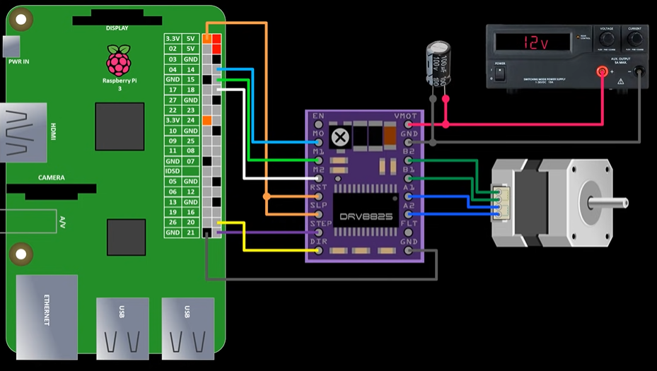

# Nema-17-Raspberry-Pi
## Interfacing Stepper Motor Nema-17 in Raspberry Pi

Always Make Sure Pi is up to date 
sudo apt-get update && sudo apt-get upgrade

use the PiGPIO library which provides hardware based PWM timing. 
sudo pigpiod

---

# DRV8825 Stepper Motor Driver Connection Guide

## Introduction
This guide provides a concise overview of connecting the DRV8825 stepper motor driver to a Raspberry Pi. The DRV8825 offers an easy and minimalistic approach to motor control, requiring as few as two GPIO pins.

## Wiring Instructions

### Minimal Wiring
- **Step Pin**: Connect to GPIO 21.
- **Direction (DIR) Pin**: Connect to GPIO 20 (optional if direction control is not needed).
- **Ground Pin**: Connect to a ground pin on the Raspberry Pi.

### Additional Connections
- **Reset (RST) and Sleep (SLP) Pins**: Connect both to a 3.3 V pin on the Raspberry Pi to pull them high.
- **Enable (EN) Pin**: Leave disconnected; it defaults to enable.
- **Fault (FLT) Pin**: Optional and can be left disconnected unless over-current or thermal shutdown detection is required.
- **Step Mode (M0, M1, M2) Pins**: Connect to GPIO 14, GPIO 15, and GPIO 18 respectively for programmable step mode control.

## Power Supply Considerations
- **Motor Power Supply**: Use a bench power supply with a voltage range between 8.2 V and 45 V.
- **Motor Voltage (VMOT) Pin**: Connect to the positive terminal of the power supply.
- **Motor Ground Pin**: Connect to the negative terminal of the power supply.

## Safety Precautions
- Ensure the power supply is off before making connections.
- Avoid reverse voltage by double-checking connections.
- Protect the DRV8825 from voltage spikes with a minimum 47 μF electrolytic capacitor, rated at least double the voltage of your power supply.

## Motor Connections
- Connect one coil of the motor to A1 & A2 and the other coil to B1 & B2.

## Current Setting
- Set the maximum current limit before attaching the motor.
- The maximum current limit (I) is calculated as:
Max Current (I) = Vref x 2

---

__Remember to always power off the motor supply before connecting or disconnecting the motor to prevent damage to the driver. For detailed schematics and code examples, refer to the official documentation or example projects.__
